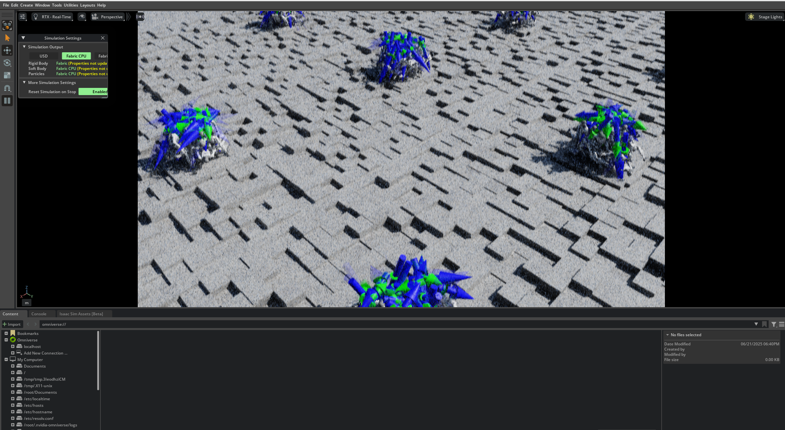
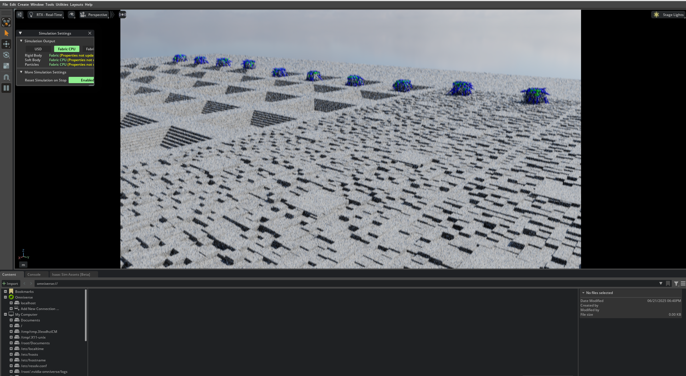
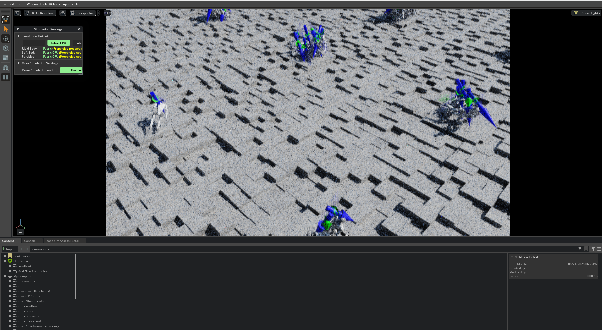
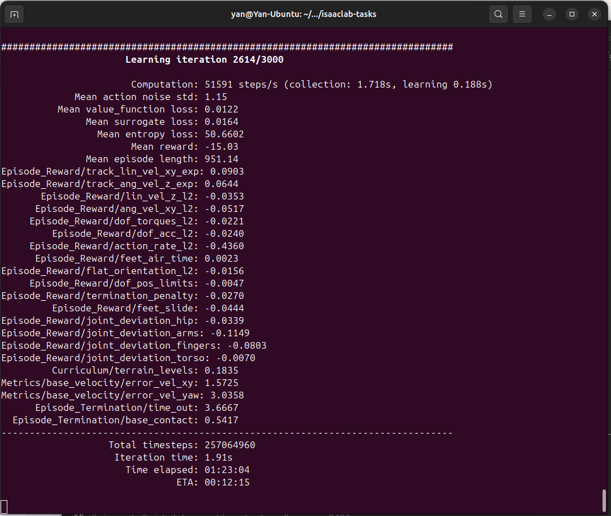

# Guided Humanoid Robot Locomotion


A reinforcement learning code for orientation controlled humanoid robot locomotion algorithm. 

**[Switch to Chinese (中文)](README_zh.md)**

## Overview

This repository contains an implementation of guided locomotion for humanoid robots within the NVIDIA Isaac Lab simulation environment. The project focuses on training agents to follow specified velocity commands (linear and angular) while maintaining physical stability and efficiency.


This project is built upon the Isaac Lab project template, allowing for isolated development and easy integration as an Omniverse extension.

**Key Features:**

- **Command-Guided Locomotion:** Humanoid agents are trained to walk, turn, and move according to real-time velocity commands.
- **Reinforcement Learning:** Utilizes reinforcement learning techniques to train robust locomotion policies.
- **Isaac Lab Integration:** Fully integrated with Isaac Lab for high-fidelity physics simulation and rendering.
- **Omniverse Extension:** Can be enabled as an extension within Omniverse for interactive use.

## Training Showcase

The training process involves thousands of parallel simulations to learn a robust locomotion policy. Here's a look at the training progression and results.

### Training in Isaac Lab

The learning process starts with agents exploring the environment and often failing.


As training progresses, the agents become more stable and begin to learn coordinated movements.


Towards the end of training, the agents exhibit stable and efficient locomotion across the environment.


### Learning Metrics

The terminal output displays key metrics from a training run, including rewards for tracking velocity commands, energy efficiency (torques), and maintaining balance.



### Final Policy in Action

After training, the humanoid agent is able to robustly follow velocity commands across challenging terrain.

*(Imagine a GIF here showing the humanoid walking and turning smoothly)*

## Installation

First, ensure you have Isaac Lab installed by following the official [installation guide](https://isaac-sim.github.io/IsaacLab/main/source/setup/installation/index.html). The conda-based installation is recommended.

Next, clone this repository to a location outside of your main `IsaacLab` directory.

```bash
git clone [https://github.com/Yanxxx/humanoid-guided-locomotion.git](https://github.com/Yanxxx/humanoid-guided-locomotion.git)
cd humanoid-guided-locomotion
```

Using a python interpreter that has Isaac Lab installed, install this project in editable mode:
```
# Use 'PATH_TO_isaaclab.sh -p' instead of 'python' if Isaac Lab is not installed in a Python venv or conda
python -m pip install -e source/Guided_Locomotion
```

Usage
You can verify the installation and run the trained agents.

List Available Environments
To see the custom task provided by this repository:
```
python scripts/list_envs.py
```
Run a Pre-trained Agent
To run a task with a trained policy (assuming a checkpoint exists):

```
Replace <RL_LIBRARY> with the library used for training (e.g., rsl_rl)
Replace <TASK_NAME> with the name from the list_envs script
python scripts/<RL_LIBRARY>/play.py --task=<TASK_NAME>
```

Start New Training
To train a new policy from scratch:
```
# Replace <RL_LIBRARY> with your RL library of choice
# Replace <TASK_NAME> with the name from the list_envs script

python scripts/<RL_LIBRARY>/train.py --task=<TASK_NAME>
```

For more details on setting up an IDE or running this project as an Omniverse extension, please refer to the original template documentation.

(The following is the original template documentation for reference)

Template for Isaac Lab Projects
Overview
This project/repository serves as a template for building projects or extensions based on Isaac Lab.
It allows you to develop in an isolated environment, outside of the core Isaac Lab repository.

Key Features:

Isolation Work outside the core Isaac Lab repository, ensuring that your development efforts remain self-contained.

Flexibility This template is set up to allow your code to be run as an extension in Omniverse.

Keywords: extension, template, isaaclab

# Installation
Install Isaac Lab by following the installation guide.
We recommend using the conda installation as it simplifies calling Python scripts from the terminal.

Clone or copy this project/repository separately from the Isaac Lab installation (i.e. outside the IsaacLab directory):

Using a python interpreter that has Isaac Lab installed, install the library in editable mode using:

```
# use 'PATH_TO_isaaclab.sh|bat -p' instead of 'python' if Isaac Lab is not installed in Python venv or conda
python -m pip install -e source/Guided_Locomotion
```

Verify that the extension is correctly installed by:

Listing the available tasks:

Note: It the task name changes, it may be necessary to update the search pattern "Template-"
(in the scripts/list_envs.py file) so that it can be listed.


```
# use 'FULL_PATH_TO_isaaclab.sh|bat -p' instead of 'python' if Isaac Lab is not installed in Python venv or conda
python scripts/list_envs.py
```

Running a task:


```
# use 'FULL_PATH_TO_isaaclab.sh|bat -p' instead of 'python' if Isaac Lab is not installed in Python venv or conda
python scripts/<RL_LIBRARY>/train.py --task=<TASK_NAME>
```

Running a task with dummy agents:

These include dummy agents that output zero or random agents. They are useful to ensure that the environments are configured correctly.

Zero-action agent

```
# use 'FULL_PATH_TO_isaaclab.sh|bat -p' instead of 'python' if Isaac Lab is not installed in Python venv or conda
python scripts/zero_agent.py --task=<TASK_NAME>
```

Random-action agent

```
# use 'FULL_PATH_TO_isaaclab.sh|bat -p' instead of 'python' if Isaac Lab is not installed in Python venv or conda
python scripts/random_agent.py --task=<TASK_NAME>
```

Set up IDE (Optional)
To setup the IDE, please follow these instructions:

Run VSCode Tasks, by pressing Ctrl+Shift+P, selecting Tasks: Run Task and running the setup_python_env in the drop down menu.
When running this task, you will be prompted to add the absolute path to your Isaac Sim installation.

If everything executes correctly, it should create a file .python.env in the .vscode directory.
The file contains the python paths to all the extensions provided by Isaac Sim and Omniverse.
This helps in indexing all the python modules for intelligent suggestions while writing code.

Setup as Omniverse Extension (Optional)
We provide an example UI extension that will load upon enabling your extension defined in source/Guided_Locomotion/Guided_Locomotion/ui_extension_example.py.

To enable your extension, follow these steps:

Add the search path of this project/repository to the extension manager:

Navigate to the extension manager using Window -> Extensions.

Click on the Hamburger Icon, then go to Settings.

In the Extension Search Paths, enter the absolute path to the source directory of this project/repository.

If not already present, in the Extension Search Paths, enter the path that leads to Isaac Lab's extension directory directory (IsaacLab/source)

Click on the Hamburger Icon, then click Refresh.

Search and enable your extension:

Find your extension under the Third Party category.

Toggle it to enable your extension.

Code formatting
We have a pre-commit template to automatically format your code.
To install pre-commit:

```
pip install pre-commit
```

Then you can run pre-commit with:

```
pre-commit run --all-files
```

Troubleshooting
Pylance Missing Indexing of Extensions
In some VsCode versions, the indexing of part of the extensions is missing.
In this case, add the path to your extension in .vscode/settings.json under the key "python.analysis.extraPaths".

```
{
    "python.analysis.extraPaths": [
        "<path-to-ext-repo>/source/Guided_Locomotion"
    ]
}
```

Pylance Crash
If you encounter a crash in pylance, it is probable that too many files are indexed and you run out of memory.
A possible solution is to exclude some of omniverse packages that are not used in your project.
To do so, modify .vscode/settings.json and comment out packages under the key "python.analysis.extraPaths"
Some examples of packages that can likely be excluded are:

```
"<path-to-isaac-sim>/extscache/omni.anim.*"         // Animation packages
"<path-to-isaac-sim>/extscache/omni.kit.*"          // Kit UI tools
"<path-to-isaac-sim>/extscache/omni.graph.*"        // Graph UI tools
"<path-to-isaac-sim>/extscache/omni.services.*"     // Services tools
...

