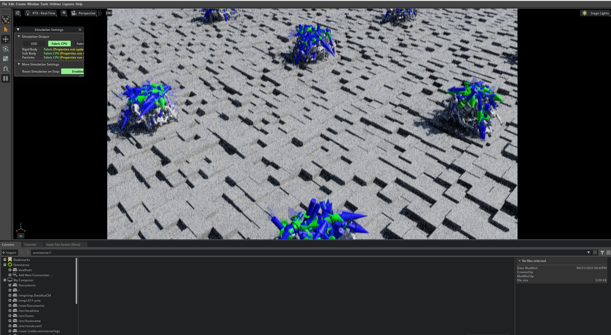
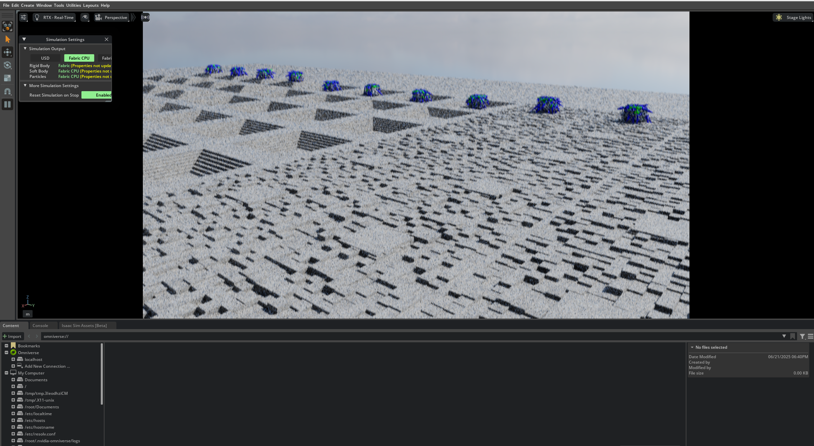
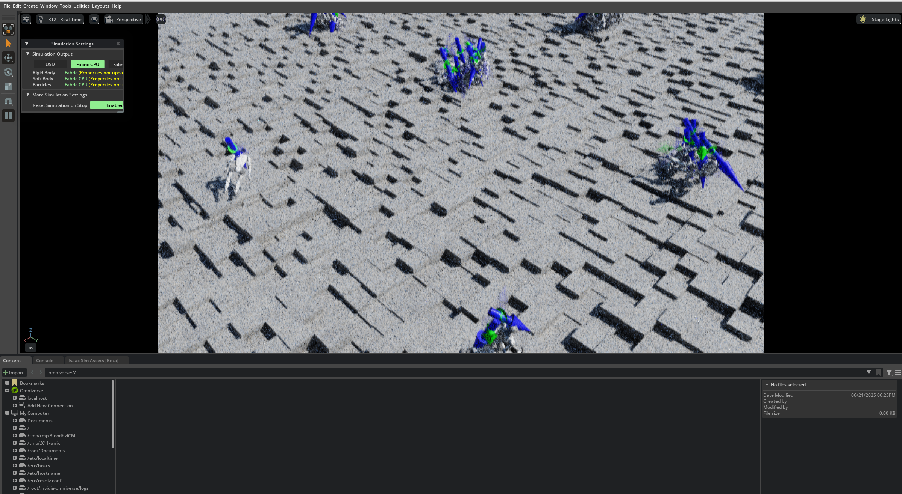
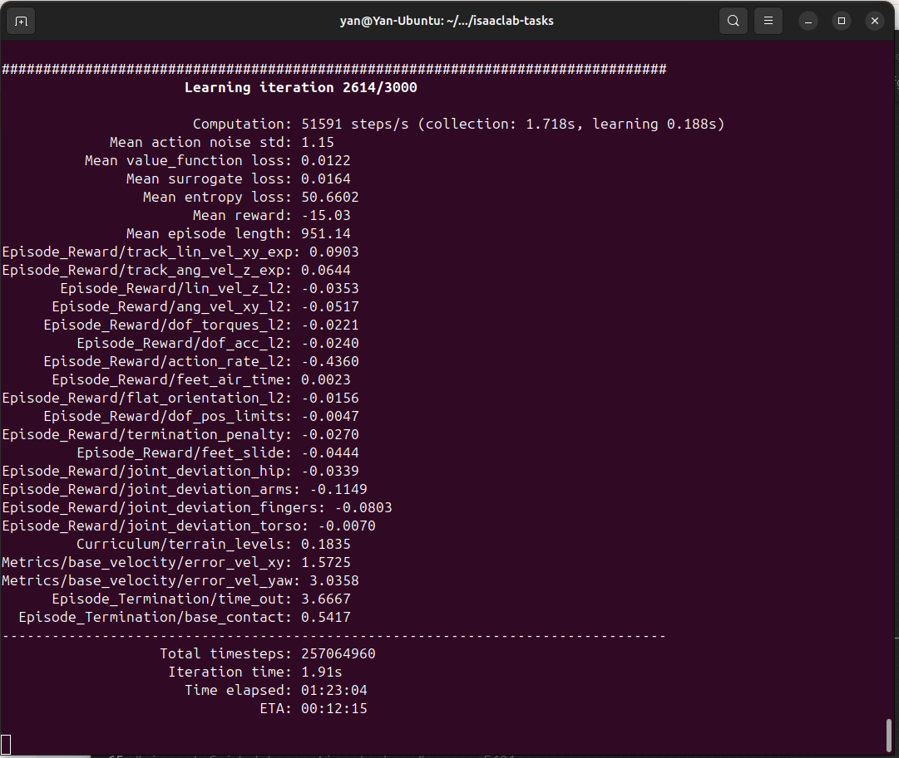

# 人形机器人引导运动

**[Switch to English](README.md)**

## 概述

本仓库包含在 NVIDIA Isaac Lab 仿真环境中实现的人形机器人引导运动。该项目专注于训练智能体遵循指定的速度指令（线性和角速度），同时保持物理稳定性和效率。


该项目基于 Isaac Lab 项目模板构建，支持隔离开发，并可轻松作为 Omniverse 扩展集成。

**主要特性:**

- **指令引导运动:** 训练人形智能体根据实时速度指令行走、转身和移动。
- **强化学习:** 利用强化学习技术来训练稳健的运动策略。
- **Isaac Lab 集成:** 与 Isaac Lab 完全集成，以实现高保真物理仿真和渲染。
- **Omniverse 扩展:** 可在 Omniverse 中作为扩展启用，以进行交互式使用。

## 训练展示

训练过程涉及数千个并行仿真，以学习稳健的运动策略。以下是训练进展和结果的展示。

### Isaac Lab 中的训练

学习过程始于智能体在环境中探索并经常失败。


随着训练的进行，智能体变得更加稳定，并开始学习协调的动作。


在训练后期，智能体在整个环境中表现出稳定而高效的运动。


### 学习指标

终端输出显示了训练运行的关键指标，包括跟踪速度指令的奖励、能量效率（力矩）和保持平衡。



### 最终策略的实际效果

经过训练后，人形智能体能够在具有挑战性的地形上稳健地遵循速度指令。

*(这里想象一个 GIF 动图，展示人形机器人平稳地行走和转弯)*

## 安装

首先，请遵循官方[安装指南](https://isaac-sim.github.io/IsaacLab/main/source/setup/installation/index.html)确保您已安装 Isaac Lab。建议使用基于 conda 的安装方法。

接下来，将此仓库克隆到您的主 `IsaacLab` 目录之外的位置。

```bash
git clone https://github.com/Yanxxx/humanoid-guided-locomotion.git
cd humanoid-guided-locomotion

使用已安装 Isaac Lab 的 python 解释器，以可编辑模式安装此项目：

# 如果 Isaac Lab 未安装在 Python venv 或 conda 中，请使用 'PATH_TO_isaaclab.sh -p' 代替 'python'
python -m pip install -e source/Guided_Locomotion

使用方法
您可以验证安装并运行训练好的智能体。

列出可用环境
查看此仓库提供的自定义任务：

python scripts/list_envs.py

运行预训练的智能体
使用训练好的策略运行任务（假设检查点已存在）：

# 将 <RL_LIBRARY> 替换为用于训练的库（例如 rsl_rl）
# 将 <TASK_NAME> 替换为 list_envs 脚本中列出的任务名称
python scripts/<RL_LIBRARY>/play.py --task=<TASK_NAME>

开始新的训练
从头开始训练新策略：

# 将 <RL_LIBRARY> 替换为您选择的 RL 库
# 将 <TASK_NAME> 替换为 list_envs 脚本中列出的任务名称
python scripts/<RL_LIBRARY>/train.py --task=<TASK_NAME>

有关设置 IDE 或将此项目作为 Omniverse 扩展运行的更多详细信息，请参阅原始的模板文档。

(以下是原始模板文档以供参考)

Template for Isaac Lab Projects
Overview
This project/repository serves as a template for building projects or extensions based on Isaac Lab.
It allows you to develop in an isolated environment, outside of the core Isaac Lab repository.

Key Features:

Isolation Work outside the core Isaac Lab repository, ensuring that your development efforts remain self-contained.

Flexibility This template is set up to allow your code to be run as an extension in Omniverse.

Keywords: extension, template, isaaclab

Installation
Install Isaac Lab by following the installation guide.
We recommend using the conda installation as it simplifies calling Python scripts from the terminal.

Clone or copy this project/repository separately from the Isaac Lab installation (i.e. outside the IsaacLab directory):

Using a python interpreter that has Isaac Lab installed, install the library in editable mode using:

# use 'PATH_TO_isaaclab.sh|bat -p' instead of 'python' if Isaac Lab is not installed in Python venv or conda
python -m pip install -e source/Guided_Locomotion

Verify that the extension is correctly installed by:

Listing the available tasks:

Note: It the task name changes, it may be necessary to update the search pattern "Template-"
(in the scripts/list_envs.py file) so that it can be listed.

# use 'FULL_PATH_TO_isaaclab.sh|bat -p' instead of 'python' if Isaac Lab is not installed in Python venv or conda
python scripts/list_envs.py

Running a task:

# use 'FULL_PATH_TO_isaaclab.sh|bat -p' instead of 'python' if Isaac Lab is not installed in Python venv or conda
python scripts/<RL_LIBRARY>/train.py --task=<TASK_NAME>

Running a task with dummy agents:

These include dummy agents that output zero or random agents. They are useful to ensure that the environments are configured correctly.

Zero-action agent

# use 'FULL_PATH_TO_isaaclab.sh|bat -p' instead of 'python' if Isaac Lab is not installed in Python venv or conda
python scripts/zero_agent.py --task=<TASK_NAME>

Random-action agent

# use 'FULL_PATH_TO_isaaclab.sh|bat -p' instead of 'python' if Isaac Lab is not installed in Python venv or conda
python scripts/random_agent.py --task=<TASK_NAME>

Set up IDE (Optional)
To setup the IDE, please follow these instructions:

Run VSCode Tasks, by pressing Ctrl+Shift+P, selecting Tasks: Run Task and running the setup_python_env in the drop down menu.
When running this task, you will be prompted to add the absolute path to your Isaac Sim installation.

If everything executes correctly, it should create a file .python.env in the .vscode directory.
The file contains the python paths to all the extensions provided by Isaac Sim and Omniverse.
This helps in indexing all the python modules for intelligent suggestions while writing code.

Setup as Omniverse Extension (Optional)
We provide an example UI extension that will load upon enabling your extension defined in source/Guided_Locomotion/Guided_Locomotion/ui_extension_example.py.

To enable your extension, follow these steps:

Add the search path of this project/repository to the extension manager:

Navigate to the extension manager using Window -> Extensions.

Click on the Hamburger Icon, then go to Settings.

In the Extension Search Paths, enter the absolute path to the source directory of this project/repository.

If not already present, in the Extension Search Paths, enter the path that leads to Isaac Lab's extension directory directory (IsaacLab/source)

Click on the Hamburger Icon, then click Refresh.

Search and enable your extension:

Find your extension under the Third Party category.

Toggle it to enable your extension.

Code formatting
We have a pre-commit template to automatically format your code.
To install pre-commit:

pip install pre-commit

Then you can run pre-commit with:

pre-commit run --all-files

Troubleshooting
Pylance Missing Indexing of Extensions
In some VsCode versions, the indexing of part of the extensions is missing.
In this case, add the path to your extension in .vscode/settings.json under the key "python.analysis.extraPaths".

{
    "python.analysis.extraPaths": [
        "<path-to-ext-repo>/source/Guided_Locomotion"
    ]
}

Pylance Crash
If you encounter a crash in pylance, it is probable that too many files are indexed and you run out of memory.
A possible solution is to exclude some of omniverse packages that are not used in your project.
To do so, modify .vscode/settings.json and comment out packages under the key "python.analysis.extraPaths"
Some examples of packages that can likely be excluded are:

"<path-to-isaac-sim>/extscache/omni.anim.*"         // Animation packages
"<path-to-isaac-sim>/extscache/omni.kit.*"          // Kit UI tools
"<path-to-isaac-sim>/extscache/omni.graph.*"        // Graph UI tools
"<path-to-isaac-sim>/extscache/omni.services.*"     // Services tools
...

